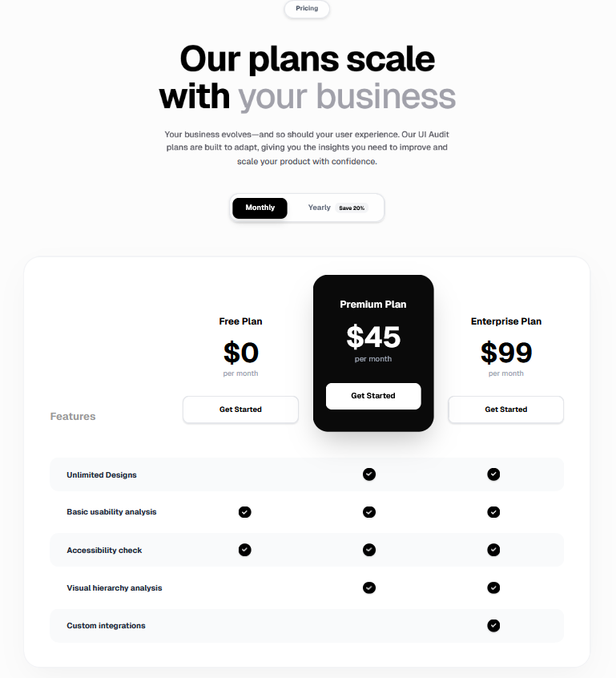
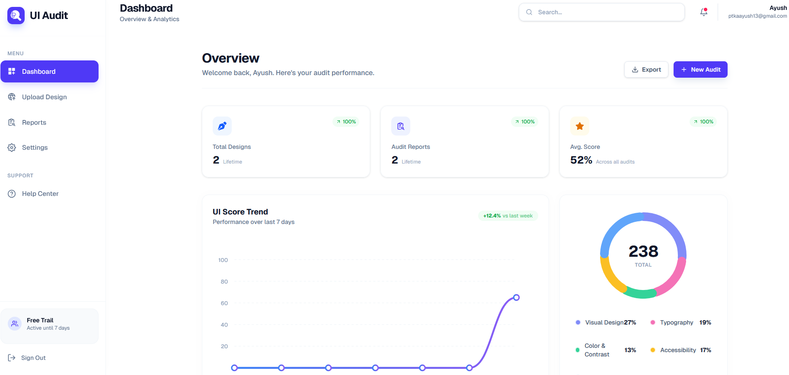
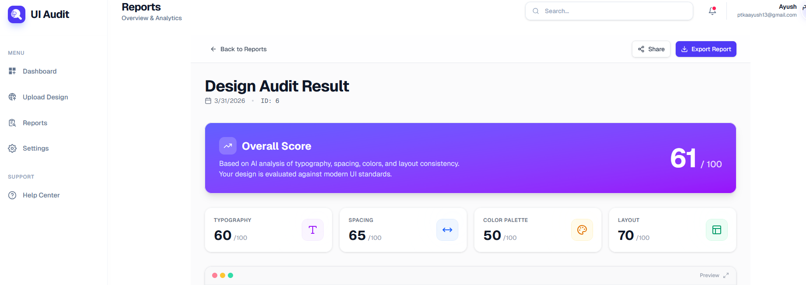

# UI Audit: Modern Interface Intelligence

Welcome to **UI Audit**, a comprehensive tool designed to analyze, evaluate, and elevate the quality of your web applications' user interfaces. This project combines cutting edge AI insights with a robust auditing framework to identify usability gaps, accessibility issues, and performance bottlenecks ensuring your UI is as clean, fast, and user friendly as possible.

---

##  Overview

UI Audit provides an end to end solution for teams looking to maintain high visual and functional standards in their products. From initial landing page evaluation to detailed dashboard metrics, UI Audit is your ultimate companion in creating seamless digital experiences.


---

##  Features

- **UI/UX Evaluation Checklist**: A structured approach to assessing visual and functional quality.
- **Accessibility Analysis**: In-depth checks based on WCAG standards to ensure inclusivity.
- **Performance Insights**: Real-time analysis of UI loading speeds and responsiveness.
- **Responsive Design Audit**: Ensuring consistency and usability across all device sizes.
- **Visual Consistency Checks**: Identifying discrepancies in typography, spacing, and color palettes.
- **AI-Powered Suggestions**: Leverages intelligence to provide actionable UX improvements.
- **Score-based UI Rating**: A definitive system to track and improve your UI quality over time.

---

##  Tech Stack

### Frontend
- **Framework**: [Next.js](https://nextjs.org/) (App Router)
- **Styling**: [Tailwind CSS](https://tailwindcss.com/)
- **State Management**: [Redux](https://redux-toolkit.js.org/)
- **Language**: JavaScript/TypeScript

### Backend
- **Framework**: [FastAPI](https://fastapi.tiangolo.com/) (Python)
- **Database**: [PostgreSQL](https://www.postgresql.org/)
- **ORM**: SQLAlchemy / Tortoise (as applicable)
- **AI/ML**: Custom analysis scripts

---

## 📁 Project Structure

```text
Ui-Audit/
├── 📁 Assests/             # Brand assets and project screenshots
│   ├── Landingpage.png
│   ├── Dashboard.png
│   └── ...
├── 📁 Backend/             # Python-based API and Audit Intelligence
│   ├── 📁 app/             # Main application logic (API, models, services)
│   ├── requirements.txt    # Backend dependencies
│   └── main.py             # Server entry point
├── 📁 Frontend/            # Next.js Web Application
│   ├── 📁 app/             # Next.js App Router (pages, layout, components)
│   ├── 📁 components/      # Reusable UI components
│   ├── package.json        # Frontend dependencies
│   └── tailwind.config.js  # Styling configuration
├── vercel.json             # Deployment configuration
└── README.md               # You are here!
```

---

##  Screenshots

| Landing Page | Pricing | Dashboard | Reports |
| :---: | :---: | :---: | :---: |
|   
   
   
   |

---

##  Getting Started

### Prerequisites
- Node.js (v18+)
- Python (v3.10+)
- PostgreSQL

### 1. Backend Setup
```bash
cd Backend
python -m venv venv
source venv/bin/activate # or venv\Scripts\activate on Windows
pip install -r requirements.txt
python main.py
```

### 2. Frontend Setup
```bash
cd Frontend
npm install
npm run dev
```

---

##  License

This project is licensed under the [MIT License](LICENSE).

